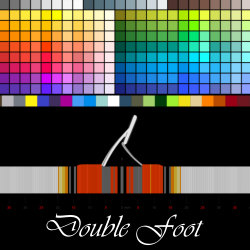
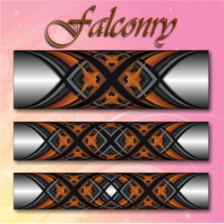

<html>
<head>
<title>Cross Wrap Pattern</title>
<link href="css/style.css" rel="stylesheet" type="text/css">
</head>
<body>
		

 <svg xmlns="http://www.w3.org/2000/svg" xml:space="preserve" width="auto" height="90" version="1.1" style="shape-rendering:geometricPrecision; text-rendering:geometricPrecision; image-rendering:optimizeQuality; fill-rule:evenodd; clip-rule:evenodd"
viewBox="0 0 774 153"
 xmlns:xlink="http://www.w3.org/1999/xlink">
  <defs>
  
  <radialGradient id="id0" gradientUnits="objectBoundingBox" cx="-5.99829%" cy="105.001%" r="50.001%" fx="-5.99829%" fy="105.001%">
   <stop offset="0" style="stop-color:#FEFEFE"/>
   <stop offset="0.0117647" style="stop-color:#FEFEFE"/>
   <stop offset="1" style="stop-color:black"/>
   <stop offset="1" style="stop-color:black"/>
  </radialGradient>
  <radialGradient id="id1" gradientUnits="objectBoundingBox" cx="-4.9984%" cy="98.0023%" r="50.0012%" fx="-4.9984%" fy="98.0023%">
   <stop offset="0" style="stop-color:#FF00FC"/>
   <stop offset="0.0117647" style="stop-color:#FEFEFE"/>
   <stop offset="1" style="stop-color:black"/>
   <stop offset="1" style="stop-color:black"/>
  </radialGradient>
  <radialGradient id="id2" gradientUnits="objectBoundingBox" cx="49.0005%" cy="50%" r="50.0009%" fx="49.0005%" fy="50%">
   <stop offset="0" style="stop-color:#FFCC00"/>
   <stop offset="1" style="stop-color:#FF9C33"/>
  </radialGradient>
  <radialGradient id="id3" gradientUnits="objectBoundingBox" xlink:href="#id2" cx="49.0015%" cy="50%" r="50.0012%" fx="49.0015%" fy="50%">
  </radialGradient>
  <radialGradient id="id4" gradientUnits="objectBoundingBox" xlink:href="#id2" cx="48.9998%" cy="50%" r="50%" fx="48.9998%" fy="50%">
  </radialGradient>
 </defs>
 <g id="Layer_x0020_1">
  <metadata id="CorelCorpID_0Corel-Layer"/>
  <path class="fil0" d="M88 32c32,0 58,25 58,57 0,26 -17,48 -41,55 0,9 -12,9 -19,9 -5,0 -11,-1 -14,-2 -4,-2 -6,-7 -7,-9 -20,-9 -34,-29 -34,-53 0,-32 25,-57 57,-57z"/>
  <path class="fil1" d="M89 34c30,0 54,24 54,54 0,25 -16,46 -39,52 0,2 -2,5 -4,6 -2,2 -6,3 -15,3 -8,0 -17,-2 -18,-12 -18,-8 -31,-27 -31,-49 0,-30 24,-54 53,-54z"/>
  <path class="fil0" d="M56 45c0,0 6,-1 11,6 2,1 3,3 5,5l0 0c0,0 -13,-1 -19,10 -6,10 2,18 2,18 0,0 1,1 0,-1 0,-1 -4,-7 -2,-12 2,-6 5,-11 11,-13 4,-1 7,-1 9,0 5,5 10,11 10,11 0,0 3,3 4,5 1,2 0,7 -1,10 -3,3 -4,4 -4,4 0,0 -9,-1 -13,-2 -4,-1 -13,-1 -17,0 0,0 -1,0 1,0 1,0 3,0 8,1 5,0 8,0 10,1 2,1 7,1 9,1 3,0 3,0 3,-1 0,0 0,0 0,0 0,0 2,-1 4,-4 1,-3 1,-7 1,-9 1,0 2,1 2,1 1,-1 3,-2 3,-2l-13 -15 -8 -11c0,0 -3,-4 -5,-6 -3,-2 -10,-2 -11,3zm47 32c-1,1 -1,4 0,7 2,5 2,6 2,6 0,0 0,1 -1,-1 -2,-3 -3,-6 -3,-9 0,-1 0,-2 1,-2 -1,0 -3,-2 -3,-3 0,0 0,-2 1,0 1,2 2,1 2,1 0,1 9,-11 19,-19 11,-7 19,-8 19,-8l-4 7c0,0 -2,-1 -4,-1 -3,1 -8,5 -13,9 3,0 9,3 12,8 3,7 0,15 0,15l2 0c0,0 0,-2 0,-2 0,0 1,3 -1,3 -1,0 -7,0 -14,0 -8,1 -10,2 -10,2 0,0 -1,0 0,-1 0,0 4,0 12,-1 8,-1 9,-1 9,-1 0,0 2,-6 1,-11 -1,-4 -4,-8 -9,-9 -2,-1 -4,-1 -5,-1 -5,4 -11,9 -13,11z"/>
  <path class="fil0" d="M85 104c0,0 2,-5 6,-7 1,-1 2,-1 3,-1 7,-1 7,6 7,10 0,9 -1,32 -1,32 0,0 -4,7 -14,7 -10,-1 -11,-4 -12,-6 -1,-3 4,-14 4,-14l7 -21z"/>
  <path class="fil2" d="M88 135c2,0 10,0 11,-2 1,-2 1,-7 -1,-8 -1,0 -1,0 -3,0 -3,0 -6,1 -6,1 0,0 1,-2 -2,-3 -4,0 -7,0 -9,4 -1,4 -1,5 -1,5 2,2 8,3 11,3z"/>
  <path class="fil3" d="M77 133c0,0 3,3 7,3 4,0 8,1 10,0 2,-1 5,-2 5,-2 -1,10 -14,11 -20,8 -4,-2 -4,-4 -4,-6 1,-2 2,-3 2,-3z"/>
  <path class="fil3" d="M99 103l-12 0c0,0 1,-2 4,-4 2,-2 4,-2 5,-2 1,0 4,1 3,6z"/>
  <path class="fil0" d="M55 125c1,0 3,2 4,6 0,1 0,1 0,2 1,4 2,6 -6,10 -7,4 -11,7 -11,7 0,0 0,0 0,0 0,0 -3,1 -6,0 -3,-1 -4,-3 -5,-4 -1,0 -3,0 -5,-2 -2,-1 -2,-3 -2,-4 -1,0 -5,-3 -5,-8 0,0 1,-1 1,-3 0,-2 2,-11 6,-16 3,-3 4,-5 6,-6 2,-1 4,-1 7,0 1,0 2,1 3,2 2,0 3,1 5,2 3,0 5,1 6,2 1,1 1,2 1,3 0,1 0,2 -1,2 0,1 0,1 -1,1l1 1c1,2 2,3 2,5z"/>
  <path class="fil4" d="M25 139c0,0 1,1 0,1 0,0 0,2 2,3 2,2 4,2 5,2 0,-1 0,0 1,0 0,0 0,3 3,4 3,1 5,0 5,0 0,-1 4,-3 12,-7 6,-4 6,-5 5,-9 0,0 0,-1 0,-1 -1,-4 -3,-6 -3,-6 -1,0 -1,1 -1,1 -3,4 -15,13 -15,13 -1,0 -1,0 -1,0 -1,0 -1,-1 0,-1 0,0 12,-9 14,-12 2,-3 2,-4 -1,-6 0,-1 0,-1 -1,-2 -1,-1 -3,-2 -4,-2 -1,0 -2,1 -4,2 -2,2 -9,11 -9,11 0,0 0,0 -1,0 0,0 0,-1 0,-1 0,0 7,-9 9,-11 1,-1 2,-1 2,-2 0,-1 -2,-3 -3,-3 0,0 -1,0 -1,0 -2,-1 -4,-2 -8,1 -2,2 -4,5 -6,8 -2,3 -3,6 -4,8 0,0 0,0 0,0 0,1 0,1 0,1 0,1 0,1 0,2 -1,4 4,6 4,6z"/>
  <path class="fil5" d="M45 116c0,0 1,-1 1,-1 2,0 3,1 5,3l0 0c0,0 1,0 1,-1 0,0 0,-1 1,-1 0,-1 -1,-2 -1,-2 -1,-1 -2,-2 -5,-2 -3,-1 -4,-1 -5,-2 -1,-1 -2,-1 -4,-2 -2,-1 -3,-1 -5,0 -2,1 -3,3 -6,6 -2,2 -3,6 -4,9 0,-1 0,-1 0,-1 2,-4 5,-7 7,-9 5,-3 8,-2 10,-2 0,1 0,1 0,1 2,0 4,3 5,4z"/>
  <path class="fil6" d="M56 84c0,0 0,0 -1,-1 0,-1 -4,-7 -2,-12 2,-6 5,-11 11,-13 4,-1 7,-1 9,0 5,5 10,11 10,11 0,0 3,3 4,5 1,2 0,7 -1,10 -3,3 -4,4 -4,4 0,0 -9,-1 -13,-2 -3,0 -8,-1 -13,-1l0 -1z"/>
  <path class="fil7" d="M108 89l-3 1c0,0 0,-1 -2,-6 -1,-3 -1,-6 0,-7 2,-2 8,-7 13,-11 1,0 3,0 5,1 5,1 8,5 9,9 1,5 -1,11 -1,11 0,0 -1,0 -9,1 -7,0 -11,1 -12,1z"/>
  <path class="fil2" d="M15 109l-1 -3c1,-1 1,-1 2,-1 1,0 1,-1 1,-2 0,0 -1,0 -1,0 0,-1 -1,-1 -1,-1 -1,1 -1,1 -2,1 0,0 0,1 0,2 -1,1 -1,2 -2,3 -1,1 -2,1 -4,1 -1,1 -1,1 -2,0 -1,0 -2,0 -3,0 0,-1 -1,-2 -1,-3 0,-1 0,-2 1,-3 1,-1 2,-1 4,-2l1 3c-1,0 -2,1 -2,1 0,0 0,0 0,1 0,0 0,1 0,1 1,0 1,0 1,0 1,0 1,0 1,-1 0,0 1,0 1,-1 0,-1 0,-2 1,-3 0,-1 1,-1 2,-1 0,-1 1,-1 2,-1 1,-1 3,-1 4,0 1,0 2,0 2,1 1,0 1,1 1,2 1,1 0,3 -1,4 -1,0 -2,1 -4,2zm-15 -12l0 -3 7 0 0 -3 -7 0 0 -3 19 -1 0 4 -8 0 0 3 8 0 0 3 -19 0zm17 -18l-1 3 3 1 0 3 -18 -6 0 -3 19 -1 0 3 -3 0zm-5 0l-6 0 6 2 0 -2zm8 -4l-18 -5 2 -5c0,-1 0,-2 1,-2 0,-1 1,-1 2,-1 1,0 2,0 3,0 1,1 2,1 2,1 1,1 1,1 2,2 0,0 0,1 0,1 1,0 1,0 1,0 0,-1 1,-1 1,-1 1,0 1,0 1,0l6 0 -1 4 -6 0c-1,0 -1,0 -1,0 -1,0 -1,0 -1,0l0 1 7 2 -1 3zm-10 -6l1 -2c0,0 0,0 0,0 0,-1 0,-1 -1,-1 0,0 0,0 -1,-1 0,0 -1,0 -1,0 0,0 -1,1 -1,1l0 2 3 1zm-4 -12l4 -8 3 2 -2 5 3 1 2 -5 3 2 -2 4 4 2 2 -5 4 2 -4 7 -17 -7zm13 -22l1 -2 9 6c1,1 2,2 3,2 1,1 1,2 2,2 0,1 0,2 0,2 0,1 0,2 -1,2 0,1 0,1 -1,2 0,0 -1,0 -1,0 -1,0 -1,0 -2,0 -1,0 -2,0 -2,0 -1,-1 -2,-1 -3,-2l-9 -7 2 -2 9 7c1,0 2,1 2,1 1,0 1,0 2,-1 0,0 0,-1 0,-1 -1,-1 -1,-2 -2,-2l-9 -7zm5 -6l2 -2 10 4 -7 -7 2 -2 13 14 -2 2 -10 -5 7 7 -2 2 -13 -13zm10 -10l8 -5 2 4 -2 2 8 11 -2 2 -9 -12 -2 2 -3 -4zm11 -7l2 -1 10 16 -3 2 -9 -17zm6 -3l3 -1 6 13 4 -2 2 4 -7 3 -8 -17zm16 -6l4 -1 3 6 1 -6 3 -1 -2 11 2 8 -4 1 -1 -8 -6 -10zm14 7c0,-3 0,-6 1,-7 1,-2 2,-3 4,-3 1,0 3,1 4,2 1,2 1,4 1,7 0,3 0,4 0,6 -1,1 -1,2 -2,3 -1,1 -2,1 -3,1 -1,0 -2,0 -2,-1 -1,0 -2,-1 -2,-3 -1,-1 -1,-3 -1,-5zm3 0c0,2 0,3 1,4 0,1 0,1 1,1 1,0 1,0 2,-1 0,-1 0,-2 0,-5 0,-1 0,-3 -1,-3 0,-1 -1,-2 -1,-2 -1,0 -1,1 -2,2 0,0 0,2 0,4zm18 -9l3 0 -2 12c0,1 0,2 0,3 -1,1 -1,1 -1,2 -1,1 -1,1 -2,1 0,1 -1,1 -2,1 -1,0 -1,0 -2,-1 0,0 -1,0 -1,-1 0,0 -1,-1 -1,-1 0,-1 0,-2 0,-2 0,-2 0,-3 0,-4l1 -11 3 1 -1 11c0,1 0,2 0,2 0,1 1,1 1,1 1,1 1,0 2,0 0,-1 0,-2 0,-3l2 -11zm13 3l5 2c1,0 2,1 2,2 0,1 0,2 0,3 -1,1 -1,2 -2,3 0,0 -1,0 -1,0 1,1 1,2 1,2 0,1 0,2 -1,3 0,1 0,2 -1,3 0,0 -1,1 -1,1 -1,0 -1,1 -2,0 0,0 -1,0 -1,0l-5 -1 6 -18zm1 8l1 0c0,0 1,0 1,0 0,0 0,-1 1,-1 0,-1 0,-1 0,-1 0,-1 -1,-1 -1,-1l-1 -1 -1 4zm-3 7l2 0c0,0 1,0 1,0 0,0 1,-1 1,-1 0,-1 0,-1 0,-2 0,0 -1,0 -1,0l-2 -1 -1 4zm15 -10l2 1 -6 13 4 2 -2 4 -7 -4 9 -16zm10 5l7 5 -2 3 -5 -3 -1 3 4 3 -3 3 -4 -3 -2 3 5 3 -3 3 -7 -4 11 -16zm10 8l6 6 -2 2 -4 -3 -2 2 3 3 -2 3 -4 -3 -2 3 3 3 -3 3 -6 -5 13 -14zm9 9l3 4c1,0 1,1 1,2 0,0 0,1 -1,2 0,1 -1,2 -2,2 0,1 -1,2 -2,3 -2,1 -3,2 -4,2 -1,1 -2,1 -3,1 -1,1 -1,0 -2,0 -1,0 -1,0 -2,-1l-2 -3 14 -12zm-1 5l-8 6 0 1c1,0 1,1 2,1 0,0 0,0 1,-1 1,0 2,-1 3,-1 1,-2 2,-3 3,-3 0,-1 0,-2 -1,-2l0 -1z"/>
  <path class="fil3" d="M205 86l9 4c-3,7 -6,12 -10,15 -4,4 -8,5 -13,5 -6,0 -11,-3 -14,-8 -3,-6 -4,-13 -2,-23 2,-10 5,-18 10,-24 5,-6 11,-9 17,-9 6,0 10,3 13,7 2,3 2,7 3,12l-10 2c0,-3 -1,-5 -2,-7 -2,-2 -4,-3 -6,-3 -4,0 -7,2 -9,5 -3,3 -5,9 -6,16 -2,8 -2,13 0,17 2,3 4,5 7,5 3,0 5,-2 7,-4 3,-2 4,-5 6,-10zm22 23l-9 0 7 -44 9 0 -1 6c2,-3 3,-5 4,-6 2,-1 3,-1 5,-1 2,0 3,0 5,2l-4 10c-2,-1 -3,-2 -4,-2 -2,0 -3,1 -4,2 -1,0 -2,2 -3,4 0,3 -2,8 -3,15l-2 14zm18 -23c1,-4 2,-7 5,-11 2,-4 4,-7 7,-9 3,-1 6,-2 10,-2 5,0 9,2 11,6 3,5 3,10 2,17 -1,7 -4,12 -8,17 -4,4 -8,6 -13,6 -3,0 -6,-1 -9,-3 -2,-1 -4,-4 -5,-8 0,-3 0,-8 0,-13zm9 1c0,4 0,8 1,10 1,2 3,4 5,4 3,0 5,-2 7,-4 2,-2 3,-6 4,-10 1,-5 0,-8 -1,-10 -1,-3 -3,-4 -5,-4 -2,0 -4,1 -6,4 -2,2 -4,5 -5,10zm28 10l10 -2c0,2 0,4 1,5 1,1 2,2 5,2 2,0 4,-1 5,-2 1,-1 2,-2 2,-3 0,-1 0,-2 0,-2 -1,-1 -2,-1 -3,-2 -7,-2 -11,-4 -13,-6 -2,-2 -3,-5 -2,-10 0,-4 2,-7 5,-9 3,-3 6,-4 11,-4 5,0 8,1 10,3 2,2 3,5 3,8l-9 3c0,-2 0,-4 -1,-5 -1,0 -2,-1 -4,-1 -2,0 -4,1 -5,1 -1,1 -2,2 -2,3 0,1 0,1 1,2 0,1 3,2 8,3 4,2 7,3 9,6 1,2 2,5 1,8 -1,4 -3,8 -6,11 -3,3 -7,4 -12,4 -4,0 -8,-1 -10,-3 -2,-3 -4,-6 -4,-10zm36 0l10 -2c0,2 0,4 1,5 1,1 3,2 5,2 2,0 4,-1 5,-2 1,-1 2,-2 2,-3 0,-1 0,-2 0,-2 -1,-1 -2,-1 -3,-2 -7,-2 -11,-4 -13,-6 -2,-2 -3,-5 -2,-10 1,-4 2,-7 5,-9 3,-3 7,-4 11,-4 5,0 8,1 10,3 2,2 3,5 3,8l-8 3c0,-2 -1,-4 -2,-5 -1,0 -2,-1 -4,-1 -2,0 -4,1 -5,1 -1,1 -1,2 -2,3 0,1 0,1 1,2 1,1 3,2 8,3 4,2 7,3 9,6 1,2 2,5 1,8 -1,4 -2,8 -5,11 -4,3 -8,4 -13,4 -4,0 -8,-1 -10,-3 -2,-3 -3,-6 -4,-10zm62 12l0 -61 9 0 0 42 16 -42 11 0 1 43 14 -43 10 0 -22 61 -10 0 -1 -46 -17 46 -11 0zm62 0l-8 0 7 -44 8 0 -1 6c2,-3 4,-5 5,-6 1,-1 3,-1 4,-1 2,0 4,0 6,2l-5 10c-1,-1 -2,-2 -4,-2 -1,0 -2,1 -3,2 -1,0 -2,2 -3,4 -1,3 -2,8 -3,15l-3 14zm29 -31l-8 -2c2,-4 4,-7 7,-9 2,-2 6,-3 10,-3 4,0 7,0 9,1 1,2 3,3 3,5 0,2 0,6 -1,11l-2 14c-1,3 -1,6 -1,8 0,2 0,4 0,6l-8 0c0,-1 -1,-2 -1,-3 0,-1 0,-1 0,-2 -2,2 -3,4 -5,5 -2,1 -4,1 -6,1 -4,0 -6,-1 -8,-3 -1,-3 -2,-6 -1,-10 0,-2 1,-5 2,-7 2,-2 3,-3 5,-4 2,-1 4,-2 8,-3 4,-1 7,-2 9,-3l0 -1c0,-2 0,-4 -1,-5 0,-1 -2,-1 -4,-1 -2,0 -3,0 -4,1 -1,1 -2,2 -3,4zm10 10c-1,0 -3,1 -5,2 -3,0 -5,1 -6,2 -1,1 -2,2 -2,4 0,2 0,3 1,4 0,1 2,2 3,2 2,0 3,-1 5,-2 1,-1 2,-3 3,-4 0,-1 1,-3 1,-6l0 -2zm22 -23l8 0 -1 6c1,-2 3,-4 5,-5 2,-2 4,-2 7,-2 4,0 7,2 9,6 2,4 2,9 1,17 -1,7 -4,13 -7,17 -4,4 -7,6 -11,6 -2,0 -4,0 -5,-1 -1,-1 -3,-3 -4,-5l-4 22 -9 0 11 -61zm5 21c-1,5 -1,9 0,11 1,3 3,4 5,4 2,0 4,-1 6,-3 2,-3 3,-6 4,-11 0,-5 0,-8 -1,-11 -1,-2 -2,-3 -4,-3 -3,0 -5,1 -6,3 -2,2 -3,6 -4,10zm45 23l11 -61 15 0c5,0 9,0 11,1 2,0 4,2 5,6 2,3 2,7 1,12 -1,3 -2,6 -3,9 -2,3 -3,5 -5,6 -2,2 -4,3 -5,3 -3,1 -6,1 -10,1l-6 0 -4 23 -10 0zm18 -51l-3 18 5 0c4,0 7,-1 8,-1 1,-1 3,-2 3,-3 1,-2 2,-3 2,-5 1,-3 1,-4 0,-6 -1,-1 -2,-2 -3,-3 -2,0 -4,0 -7,0l-5 0zm37 20l-7 -2c1,-4 3,-7 6,-9 3,-2 6,-3 10,-3 4,0 7,0 9,1 2,2 3,3 3,5 1,2 1,6 0,11l-3 14c0,3 -1,6 -1,8 0,2 0,4 1,6l-9 0c0,-1 0,-2 0,-3 0,-1 0,-1 0,-2 -2,2 -4,4 -6,5 -2,1 -4,1 -6,1 -3,0 -6,-1 -7,-3 -2,-3 -2,-6 -2,-10 1,-2 2,-5 3,-7 1,-2 3,-3 4,-4 2,-1 5,-2 8,-3 4,-1 7,-2 9,-3l0 -1c1,-2 0,-4 0,-5 -1,-1 -2,-1 -5,-1 -1,0 -3,0 -4,1 -1,1 -2,2 -3,4zm11 10c-1,0 -3,1 -6,2 -3,0 -4,1 -5,2 -2,1 -2,2 -3,4 0,2 0,3 1,4 1,1 2,2 3,2 2,0 4,-1 5,-2 2,-1 2,-3 3,-4 0,-1 1,-3 1,-6l1 -2zm37 -23l-2 9 -6 0 -3 18c-1,4 -1,6 -1,6 0,1 0,1 1,2 0,0 0,0 1,0 1,0 2,0 4,-1l-1 10c-2,1 -5,1 -7,1 -2,0 -3,0 -5,-1 -1,-1 -1,-1 -2,-3 0,-1 0,-2 0,-4 0,-2 0,-4 1,-9l3 -19 -4 0 2 -9 4 0 1 -9 10 -7 -2 16 6 0zm21 0l-1 9 -6 0 -3 18c-1,4 -1,6 -1,6 0,1 0,1 0,2 1,0 1,0 2,0 0,0 2,0 3,-1l0 10c-3,1 -5,1 -8,1 -1,0 -3,0 -4,-1 -1,-1 -2,-1 -2,-3 -1,-1 -1,-2 -1,-4 0,-2 1,-4 1,-9l4 -19 -4 0 1 -9 4 0 2 -9 10 -7 -3 16 6 0zm21 30l8 2c-1,4 -4,8 -7,10 -2,2 -6,3 -9,3 -6,0 -10,-2 -12,-7 -2,-4 -2,-10 -1,-16 1,-7 4,-13 7,-17 4,-4 8,-6 13,-6 5,0 8,2 10,6 2,5 3,11 1,20l-22 0c-1,4 0,7 1,8 1,2 2,3 4,3 2,0 3,0 4,-1 1,-1 2,-3 3,-5zm2 -12c1,-3 1,-6 0,-8 -1,-1 -3,-2 -4,-2 -2,0 -4,1 -6,2 -1,2 -2,5 -3,8l13 0zm21 26l-9 0 7 -44 9 0 -1 6c1,-3 3,-5 4,-6 2,-1 3,-1 4,-1 3,0 4,0 6,2l-5 10c-1,-1 -2,-2 -3,-2 -2,0 -3,1 -4,2 -1,0 -2,2 -3,4 -1,3 -2,8 -3,15l-2 14zm47 0l-9 0 4 -23c1,-4 1,-8 1,-9 0,-1 0,-2 -1,-3 -1,-1 -2,-1 -3,-1 -2,0 -3,0 -5,1 -1,1 -2,3 -3,5 -1,2 -1,5 -2,10l-4 20 -9 0 8 -44 8 0 -1 6c4,-5 8,-7 13,-7 1,0 3,0 5,1 1,1 2,2 3,4 0,1 1,3 1,5 0,1 -1,4 -1,7l-5 28z"/>
 </g>
</svg>
    
   
    

    

    
 

     
    

  
    

   
    

   

   
    

  
    

    
    

   
    

   
    
    

   
    
    

   
    
    

   
    
    

   
    
    

   
    
    

 
    
    

 
    
    

 
    
    

 
    
    

 
    
    

 
    
    

 
    
    

 
    
    

 
    
    

 
    
    

 
    
    

 
    
	

 

 

 

 

 
    
	

 

 

 

 

 

 
    

 

 
</body>
</html>

